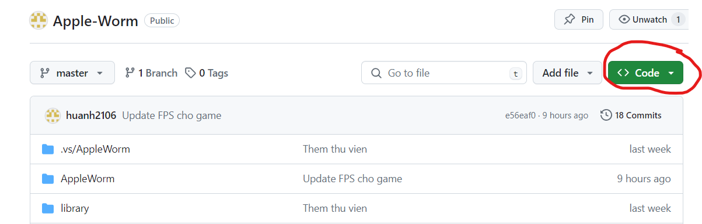
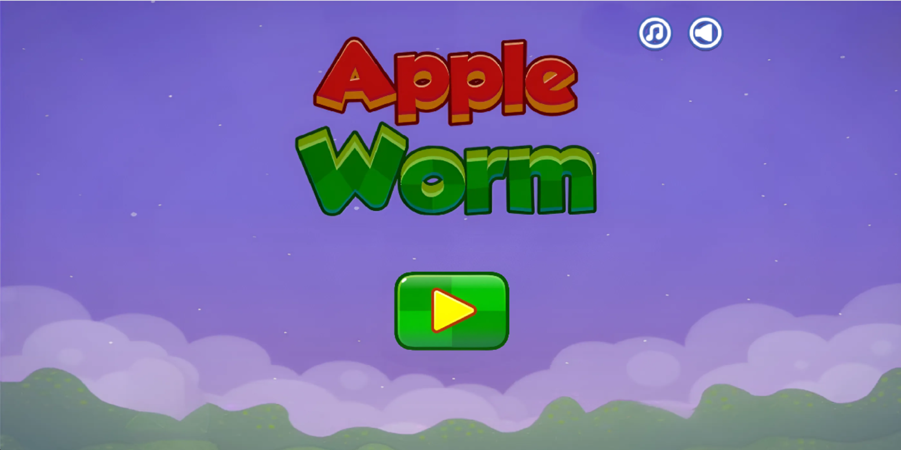
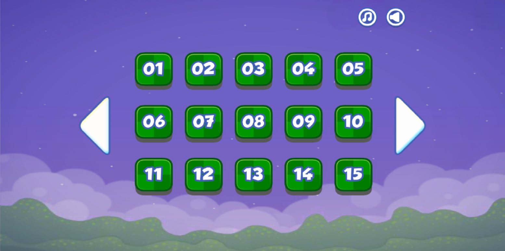
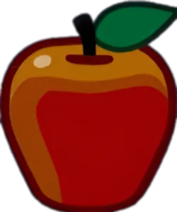
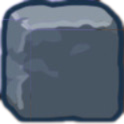
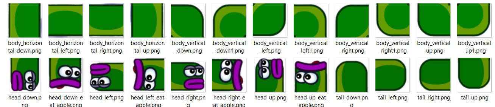
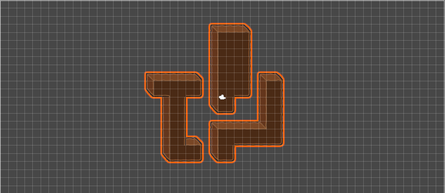
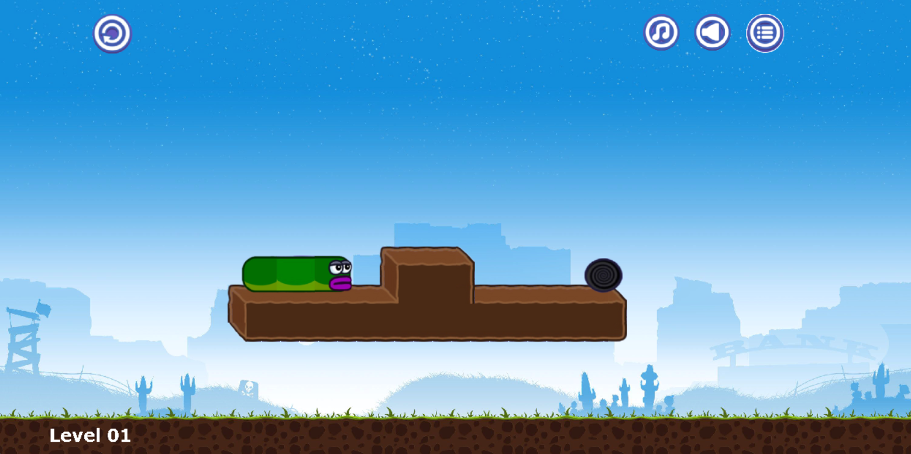
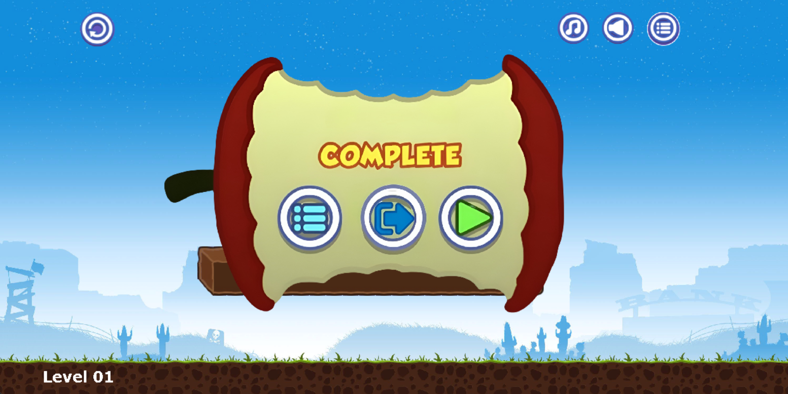
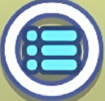

# AppleWorm by Huy

Demo game và cấu trúc của code: https://youtu.be/bWGtsP8xy7Q

# Giới thiệu game

AppleWorm là một trò chơi thể loại giải đố thoạt nhìn qua có vẻ đơn giản nhưng ẩn chứa trong đó là yêu cầu tính toán và tập trung logic. Nhiệm vụ của bạn là điều khiển một con sâu ăn một quả táo và đến được cổng thoát hiểm. Bạn có thể vượt qua tất cả các cấp độ? 

Hầu hết mọi người có thể quen thuộc với cơ chế giống như con rắn. Giờ đây, những cơ chế này đã truyền cảm hứng cho trò chơi Apple Worm này. Một con sâu bị lạc trong mê cung và bạn cần giúp anh ta trốn thoát. Đến với trò chơi, bạn có thể thấy ngay một cổng thoát. Tuy nhiên, bạn phải mất rất nhiều thời gian để đến được cổng đó.

- [0. Cách tải game](#0-cách-tải-game)
    * [Cách 1: Không bao gồm code.](#-cách-1-không-bao-gồm-code)
    * [Cách 2: Bao gồm code và có thể biên dịch.](#-cách-2-bao-gồm-code-và-có-thể-biên-dịch)
- [1. Bắt đầu game](#1-bắt-đầu-game)
- [2. Các thành phần trong game:](#2-các-thành-phần-trong-game)
- [3. Cách chơi](#3-cách-chơi)
- [4. Chiến thắng và thất bại](#4-chiến-thắng-và-thất-bại)
    * [Về đồ họa của game](#-về-đồ-họa-của-game)
    * [Về source code game](#-về-source-code-game)
- [5. Các kĩ thuật sử dụng](#5-các-kĩ-thuật-sử-dụng)
- [6. Nguồn tham khảo](#6-nguồn-tham-khảo)
- [7. Hướng phát triển](#7-hướng-phát-triển)

# 0. Cách tải game

## Cách 1: Không bao gồm code.

Tải game (được nén thành AppleWormUET.zip) tại link
sau: https://github.com/huanh2106/Apple-Worm/releases/tag/v1.0.0

Giải nén game vào một thư mục và bật AppleWorm.exe lên và chơi. 

Nếu chạy file exe không thành công do lỗi runtime thì phải chạy file VC_redist.x64.exe để cài Visual C++ Redistributable '

## Cách 2: Bao gồm code và có thể biên dịch.

**Bước 1:** Clone repo này về .  
Hoặc Chọn Code -> Download Zip 

- Yêu cầu có Visual Studio 2022 Community và tải gói C++ cần thiết 
  
**Bước 2:** Bấm vào file AppleWorm.sln dự án sẽ tự động mở trong Visual Studio. 

**Bước 3:** Bấm vào Local Windows Debugger để khởi động game

# 1. Bắt đầu game

Bấm nút Play để bắt đầu game

Một Menu chọn các level hiện lên với mức độ khó tăng dần. Ở đây tôi đã có tới 15 level và tương lai sẽ phát triển thêm.

# 2. Các thành phần trong game:

-    Apple  : Con sâu ăn apple giúp nó dài ra
     
-    Stone  :  Stone có thể được đẩy bởi con sâu và nó được coi như là công cụ để giúp con sâu vượt quá thửu thách
-    Worm   : Khi con sâu di chuyển có khá là nhiều trạng thái của các node
-    Roll back : Bấm vào nút roll back giúp quay lại từ đầu của màn chơi trong trường hợp bạn hết đường đi hoặc rơi xuống vực thẳm
-    Bật/tắt âm thanh và effect  
-    Đích đến  : Mục tiêu của con sâu là di chuyển được đến đích
-    Chọn level  : Bấm vào đây sẽ di chuyển ra menu chọn level
-    Tile map: Kĩ thuật tilemap được dùng để tạo ra phần đất cho bản đồ

   
  

- Bố cục game cơ bản:

 

# 3. Cách chơi

Trước hết, sâu của bạn đang đói. Hãy ăn một quả táo ngon. Ăn táo cũng góp phần giúp bạn trốn thoát. Khi con sâu của bạn hấp thụ quả táo, cơ thể nó sẽ phát triển. Sau đó, uốn cong cơ thể dài của mình để di chuyển đến đích. Tất nhiên, để ăn được quả táo mà không bị rơi hay bị kẹt là điều không hề đơn giản. Ngoài ra bạn còn có thể di chuyển hòn đá một cách tính toán để có thể đến đích. Mỗi bước bạn di chuyển trong Apple Worm đều phải được tính toán cẩn thận. Nếu không, bạn phải chơi lại cấp độ. Đừng quá lo lắng, trò chơi cho phép bạn chơi nhiều lần tùy thích. Càng có nhiều thời gian chơi lại một cấp độ, bạn càng nhận được nhiều kinh nghiệm. Từ đó, bạn có thể đưa ra chiến lược thông minh để vượt qua cấp độ đó.

## Di chuyển
Lên: &#8593;
Xuống: &#8595;
Trái: &#8592;
Phải: &#8594;

### Những cấp độ khó đang chờ bạn trong Apple Worm
Bạn có nghĩ đây là một trò chơi dễ dàng không? Chỉ cần điều hướng con sâu của bạn lên xuống trái và phải, sau đó đi tới đích. Điều này sẽ đúng với hai cấp độ đầu tiên. Tuy nhiên, bạn sẽ phải có cái nhìn hoàn toàn mới về trò chơi này khi lên đến cấp độ 3. Lý do là hai cấp độ đầu tiên là cấp độ hướng dẫn. Từ cấp độ thứ 3 trở đi, những thử thách thực sự sẽ đến. Hãy nhớ rằng cấp độ càng cao thì bạn càng gặp nhiều khó khăn. Đôi khi, bạn chơi lại một cấp độ hàng chục lần. Hãy bình tĩnh và đừng mất hy vọng vì đây là một trò chơi trí tuệ để kiểm tra trí não của bạn.

### Cách vượt qua mọi cấp độ trong Apple Worm
Như đã đề cập, mục tiêu chính của bạn là đi đến đích. Ăn táo là bước đầu tiên để hoàn thành mục tiêu. Có vẻ dễ dàng để có được quả táo. Tin tôi đi, con sâu của bạn có thể rơi vào khe hở ngay lập tức hoặc mắc kẹt trong một góc hẹp. Vì vậy, trước khi di chuyển bạn nên quan sát địa hình mê cung. Mê cung luôn có một số khối màu nâu với hình dạng đơn giản như hình chữ nhật, hình vuông,… Thoạt nhìn, chúng có vẻ được đặt ngẫu nhiên. Thực chất, vai trò của chúng trong mê cung là ngăn chặn con sâu của bạn trốn thoát nhưng chúng cũng có thể đóng vai trò là vật phẩm hỗ trợ cho bạn. Để tránh mọi nguy hiểm, bạn phải tính toán khéo léo từng động tác. Ước tính từng khoảng trống hoặc góc mà bạn có thể gặp phải. Với chiều dài của con sâu liệu nó có thể vượt qua được chúng không? Nếu rơi vào khoảng trống hoặc bị dồn vào góc, bạn có thể sử dụng nút phát lại để bắt đầu lại màn chơi đó.

Bạn còn có thể bật tắt nhạc và hiệu ứng âm thanh trong game bằng hai nút âm lượng ở góc trên bên trái màn hình.
# 4. Chiến thắng

- Bạn sẽ chiến thắng nếu đi được đến đích.

### Bạn có thể bấm

 để chuyển về menu chọn level 

 để thoát game.

 để chuyển sang level tiếp theo.

                  

### Đồ họa của game:
Lấy hình ảnh từ game gốc AppleWorm của Icestone Ltd

### Về source code game:

- Folder image:
    * Chứa tất cả các hình ảnh của game bao gồm cả con sâu, quả táo, đá, nút roll back, Bật/tắt âm lượng ,...
- Folder map: Chứa các hình ảnh tile map và file tile map của các màn
- Folder music: Chứa âm thanh của game và các hiệu ứng con sâu ăn quả táo, con sau di chuyển, hiệu ứng khi win và hiệu ứng khi bấm các nút 
- Folder menu: chứ hình ảnh của menu khi và nút play 
- Folder music: xử lý phần âm thanh của game - SDL2_mixer
# 5. Các kĩ thuật sử dụng

- Sử dụng thư viện SDL2.0
- Sử dụng nhiều class, vector, tách file, nạp chồng toán tử, ...
- Dùng linked list để lưu lại vị trí các node của con sâu
- Trong game check va cham rất nhiều. Ví dụ check va chạm từng node của con sâu với phần đất của bản đồ, check va chạm của con sâu với quả táo, check va chạm của con sâu với viên đá, check va chạm của viên đá với từng node của con sâu, check va chạm của viên đá với phần đất của map, check va chạm của viên đáv với quả táo, check va chạm của con sâu vơi đích
- Tạo ra trọng lực rơi cho con sâu và viên đá. nếu con sâu và đá không đúng trên phần đất của map thì nó sẽ bị rơi
- Xử lý thời gian, thao tác chuột và bàn phím, âm thanh, hình ảnh, chữ.
- Dùng các kiến thức toán học để tính toán được các của con sâu để chèn ảnh thân và lúc cong
- Tạo menu và các nút ấn di chuyển giữa các menu
- Sử dụng các kĩ thuật edit và cắt ghép để có thể lấy được hình ảnh từ game gốc
# 6. Nguồn tham khảo
- Tham khảo cách tách file và cách load hình ảnh và map trên Phát Triển Phần Mềm 123A-Z https://www.youtube.com/@PhatTrienPhanMem123AZ
- Tham khảo trên trang lazyfoo https://lazyfoo.net/tutorials/SDL/
- Tham khảo mã nguồn của game Snake trên trang course thì cách di chuyển của con sâu khá giống với cách di chuyển của con rắn
- Hình ảnh, âm thanh được lấy tự game gốc của Icestone ltd
# 7. Hướng phát triển
- Tối ưu hóa game hơn
- Tạo thêm nhiều màn chơi nữa
- Thêm nhiều item giúp có game hấp dẫn hơn
- Có thể lưu lại lịch sử các lần chơi
  
  
